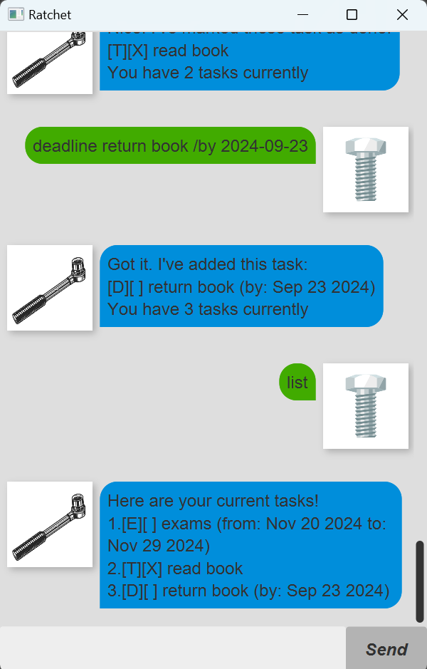

# Ratchet User Guide

<br>
<sup>Credits: [Ratchet Image](https://www.vectorstock.com/royalty-free-vector/vintage-ratchet-wrench-concept-vector-30215572),
[Bolt Image](https://en.ac-illust.com/clip-art/23670858/bolt)</sup>

Ratchet is a **desktop app for managing *tasks*, *deadlines* and *events*!**
With Ratchet you will never miss out on anything **important** ever again.


## Table of Contents

- [Quick start](#quick-start)
- [Features](#features)
  - [Adding todo tasks](#adding-todo-tasks-todo): `todo`
  - [Adding deadlines](#adding-deadlines-deadline): `deadline`
  - [Adding events](#adding-events-event): `event`
  - [Listing tasks](#listing-tasks): `list`
  - [Finding tasks](#finding-tasks-find): `find`
  - [Deleting tasks](#deleting-tasks-delete): `delete`
  - [Marking tasks as done](#marking-tasks-as-done-mark): `mark`
  - [Marking tasks as not done](#marking-tasks-as-not-done-unmark): `unmark`
  - [Exiting Ratchet Bot](#exiting-ratchet-bot-bye): `bye`


# Quick start

1. Ensure you have Java `17` or above installed in your Computer.
2. Download the latest `.jar` file from [here](https://github.com/ckclion/ip/releases).
3. Copy the file to the folder you want to use as the _home folder_ for your Ratchet Bot.
4. Open a command terminal, cd into the folder you put the jar file in, and use the java -jar ratchet.jar 
command to run the application. (Alternatively you can double-click the ratchet.jar file)
5. Refer to the [Features](#features) below for details of each command.


# Features

**NOTE**
* Words in `<UPPER_CASE>` are the parameters to be supplied by the user.
* Items in square brackets are optional.
* Extraneous parameters for commands that do not take in parameters (such as list and exit) will be ignored.


## Adding todo tasks: `todo`

Adds a todo task to the list.

Format: `todo <DESCRIPTION>`

Example: `todo read book`

```
Got it. I've added this task:
[T][] read book
You have 1 task currently
```


## Adding deadlines: `deadline`

Adds a deadline to the list.

Format: `deadline <DESCRIPTION> /by <YYYY-MM-DD>`

Example: `deadline return book /by 2024-09-23`

```
Got it. I've added this task:
[D][] return book (by: Sep 23 2024)
You have 2 tasks currently
```


## Adding events: `event`

Adds an event to the list.

Format: `event <DESCRIPTION> /from <YYYY-MM-DD> /to <YYYY-MM-DD>`

Example: `event exams /from 2024-11-20 /to 2024-11-29`

```
Got it. I've added this task:
[E][] exams (from: Nov 20 2024 to: Nov 29 2024)
You have 3 tasks currently
```


## Listing tasks

Shows a list of all tasks.

Format: `list`


## Finding tasks: `find`

Find tasks from the list containing the keyword.

Format: `find <KEYWORD>`

Example: `find book`

```
Here are the matching tasks in your list:
1.[T][] read book
```


## Deleting tasks: `delete`

Deletes tasks with the specified indexes.

Format: `delete INDEX [MORE_INDEXES]`

Example: `delete 1 2`

```
Noted. I've removed these task:
[D][] return book (by: Sep 23 2024)
[T][] read book
You have 1 task currently
```


## Marking tasks as done: `mark`

Marks tasks with the specified indexes as done.

Format: `mark INDEX [MORE_INDEXES]`

Example: `mark 1`

```
Nice! I've marked these task as done:
[T][X] read book
You have 1 task currently
```


## Marking tasks as not done: `unmark`

Marks tasks with the specified indexes as not done.

Format: `unmark INDEX [MORE_INDEXES]`

Example: `unmark 1`

```
Ok, I've marked these task as not done yet:
[T][] read book
You have 1 task currently
```


## Exiting Ratchet Bot: `bye`

Exits Ratchet Bot.

Format: `bye`
